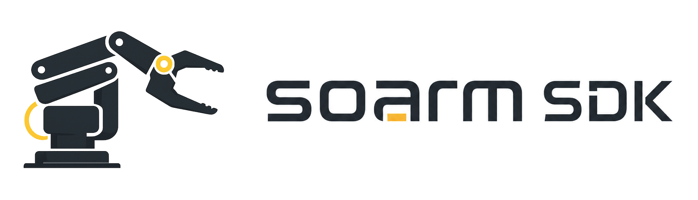

<p align="center">
  
</p>

# SOARM SDK

🦾 Python SDK and local web console for controlling a SOARM / SO-ARM101 style robotic arm with Feetech STS3215 servos.

SOARM SDK keeps hardware access, calibration, safety checks, kinematics, motion control, teaching replay, CLI tools, and the browser control console behind one shared Python package.

## Features

- Feetech STS3215 servo bus wrapper built on `scservo_sdk`
- YAML-based arm, runtime, calibration, and motor-profile configuration
- Read-only health checks before calibration or motion
- Interactive calibration and soft-limit generation
- Joint-space motion with safety checks
- Online joint streaming for teleoperation targets
- Fixed-rate timed trajectory replay with linear or PCHIP interpolation
- FK/IK helpers for the SOARM geometry
- Joint-space teaching record and replay
- Feetech motor-profile drift checks and register writes
- Local Web GUI for setup, calibration, URDF visualization, feedback, and slider control
- Mock bus for development without hardware

## Install

```bash
pip install -e .
```

This workspace uses the `soarm-sdk` conda environment for local validation:

```bash
conda run -n soarm-sdk soarm-sdk status --mock
```

## Quick Start

```bash
soarm-sdk init-config
soarm-sdk ports
soarm-sdk status
soarm-sdk calibrate
soarm-sdk home --duration 2.0
soarm-sdk web
```

For no-hardware checks, add `--mock` where supported:

```bash
soarm-sdk status --mock
soarm-sdk web --mock
```

`src/soarm_sdk/configs/` is the packaged canonical config template. The top-level
`configs/` directory is ignored by git and is used for generated, user-editable
working copies created by `soarm-sdk init-config`, `soarm-sdk ports`, or the Web UI.

## Python API

```python
from soarm_sdk import SOARM, ensure_user_config

with SOARM.from_config(ensure_user_config()) as arm:
    arm.enable()
    arm.move_home(duration=1.5)
    arm.move_joints(
        {
            "shoulder_pan": 0.0,
            "shoulder_lift": -0.4,
            "elbow_flex": 0.8,
        },
        duration=2.0,
    )
    print(arm.get_joint_positions())
```

For online teleoperation, use the SDK-owned streaming controller. It accepts
low-frequency target updates and owns the fixed-rate output loop. Use
`mode="direct"` when the application should prioritize lowest latency:

```python
from soarm_sdk import SOARM, ensure_user_config

with SOARM.from_config(ensure_user_config()) as arm:
    stream = arm.start_joint_stream(
        output_hz=200,
        target_timeout_s=0.15,
        mode="direct",
    )
    try:
        stream.update_target(
            {
                "shoulder_pan": 0.0,
                "shoulder_lift": -0.35,
                "elbow_flex": 0.65,
            }
        )
        print(stream.snapshot())
    finally:
        stream.stop()
```

## Documentation

The detailed documentation is a single static page:

- [Documentation site](https://oooer8.github.io/soarm-sdk/)
- [Source: docs/index.html](docs/index.html)

GitHub Actions uploads `docs/` as a Pages artifact and deploys it to GitHub Pages. No generated site files are committed.

## Repository Layout

```text
configs/       Generated user config working copies (gitignored except .gitkeep)
docs/          Single-page documentation site
examples/      Small Python API examples
scripts/       Bench and measurement utilities
src/soarm_sdk/     Python package
  application/ Web/CLI payload and workflow helpers
  calibration/ Calibration capture and sweep logic
  cli/         Command-line entry point and command dispatch
  config/      Packaged defaults, YAML schema, split-config loading, and persistence
  demonstration/
               Demonstration data, validation, recording, and replay
  hardware/    Feetech bus, registers, units, and motor profile writes
  kinematics/  SOARM FK/IK helpers
  model/       Shared dataclasses for joints, poses, and state
  motion/      Point-to-point motion, online streaming, and trajectory replay
  safety/      Joint, step, velocity, acceleration, and voltage guards
  testing/     Mock bus for no-hardware validation
```

See [ARCHITECTURE.md](ARCHITECTURE.md) for the package layering and import rules.

## Implementation Notes

- `soarm_sdk.arm.SOARM` is the public Python facade; entry points should call it instead of wiring low-level services directly.
- `soarm_sdk.hardware.ServoBus` owns Feetech register I/O only. Motion planning, safety policy, and calibration math live above the hardware layer.
- `SOARM.stream_joints()` is a one-shot setpoint write kept for simple streaming callers. `SOARM.start_joint_stream()` is the long-lived online controller; use `mode="direct"` for lowest-latency teleoperation and `mode="arrival"` for smooth stop-at-target behavior with velocity/acceleration limiting. Both modes own the output loop, latest-target slot, and timeout hold behavior.
- `SOARM.follow_joint_trajectory()` is for replaying already-timestamped trajectories and demonstrations.
- `soarm_sdk.application` holds shared Web/CLI payload and workflow helpers so UI code does not duplicate config, FK/IK, calibration, or safety rules.
- `src/soarm_sdk/configs/` is the only tracked canonical config set. `ensure_user_config()` copies it to a user-editable split config under `configs/`, and `SOARMConfig.save()` preserves that split layout when saving back to the generated main path.
- Focused unit tests cover the online streaming controller. Mock CLI paths and compile checks remain the lightweight baseline for broader local regression validation.

```bash
PYTHONPYCACHEPREFIX=/private/tmp/soarm-sdk-pycache conda run -n soarm-sdk python -m compileall src tests
conda run -n soarm-sdk python -m unittest discover -s tests -v
conda run -n soarm-sdk soarm-sdk status --mock
conda run -n soarm-sdk soarm-sdk fk shoulder_lift=-0.3 elbow_flex=0.5
conda run -n soarm-sdk soarm-sdk ik 0.42 0.0 0.20
```

## License

MIT
